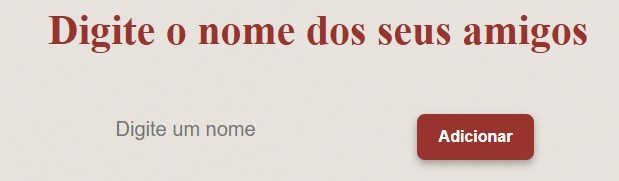
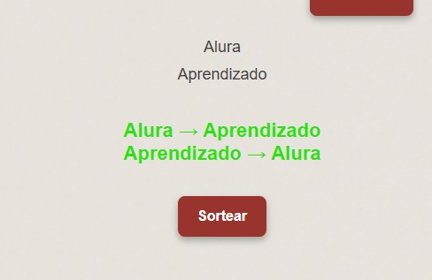

# Projeto Amigo Secreto

O meu Amigo Secreto é... 🤫🤭

##  ⚙️ Indice 
- Funcionalidades do Projeto 
- Layout
- Desenvolvedor
- Aprenda Como Jogar
- Aplicativo Utilizado

## 💻 Funcionalidades do Projeto
- Projeto: Sorteador de Amigo Secreto
Descrição Geral
O "Sorteador de Amigo Secreto" é uma aplicação web simples e interativa desenvolvida em HTML, CSS e JavaScript. O objetivo do projeto é permitir que um grupo de participantes insira seus nomes e, com um clique, o sistema realize um sorteio aleatório, distribuindo os amigos secretos de forma justa e sem repetições.

Funcionalidades

✅ Cadastro de Participantes: Os jogadores podem inserir seus nomes na lista antes do sorteio.

✅ Sorteio Aleatório: Após adicionar todos os nomes, o usuário pode iniciar o sorteio.
O algoritmo garante que ninguém tire a si mesmo.

✅ Exibição dos Resultados: O resultado do sorteio pode ser exibido de forma discreta, revelando um par por vez.
Pode ser configurado para exibir todos os pares de uma vez ou permitir que cada jogador descubra seu amigo secreto individualmente.

✅ Experiência do Usuário: Interface simples e intuitiva.
Design responsivo para uso em dispositivos móveis e desktops.

Esse projeto pode ser útil para eventos familiares, confraternizações de empresas ou amigos que desejam organizar um sorteio de maneira rápida e divertida.

## 🏜 Layout 

## 🕵🏼‍♂️ Desenvolvedor 

📱 [linkedin](https://www.linkedin.com/in/daniel-mendes-dev/)

## Linguagen Utilizada 

## Aprenda como jogar
- Insira o nome e Clique em Adicionar 

- Insira mais de 2 nomes para ser sorteado

- Aperte em Sortear Amigo

- Divirtam-se
